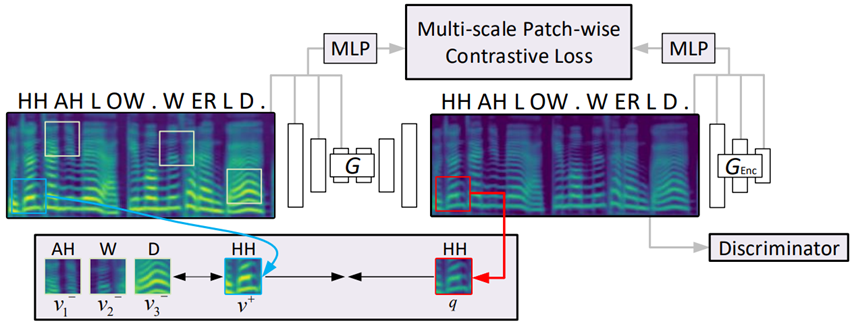

# Contrastive Voice Conversion (CVC)

###  [Demo](https://tinglok.netlify.app/files/cvc) |   [Paper](https://arxiv.org/abs/2011.00782)
<br>



<br><br><br>


This implementation is based on [CUT](https://github.com/taesungp/contrastive-unpaired-translation), thanks Taesung and Junyan for sharing codes.

We provide a PyTorch implementation of non-parallel voice conversion based on patch-wise contrastive learning and adversarial learning. Compared to baseline CycleGAN-VC, CVC only requires one-way GAN training when it comes to non-parallel one-to-one voice conversion, while improving speech quality and reducing training time. 

## Prerequisites
- Linux or macOS
- Python 3
- CPU or NVIDIA GPU + CUDA CuDNN

### Kick Start

- Clone this repo:
```bash
git clone https://github.com/Tinglok/CVC
cd CVC
```

- Install PyTorch 1.6 and other dependencies.

  For pip users, please type the command `pip install -r requirements.txt`.

  For Conda users,  you can create a new Conda environment using `conda env create -f environment.yaml`.
  
- Download pre-trained [Parallel WaveGAN](https://drive.google.com/drive/folders/1qoocM-VQZpjbv5B-zVJpdraazGcPL0So?usp=drive_open) vocoder to `./checkpoints/vocoder`.


### CVC Training and Test

- Download the `VCTK` dataset
```bash
cd dataset
wget http://datashare.is.ed.ac.uk/download/DS_10283_2651.zip
unzip DS_10283_2651.zip
unzip VCTK-Corpus.zip
cp -r ./VCTK-Corpus/wav48/p* ./voice/trainA
cp -r ./VCTK-Corpus/wav48/p* ./voice/trainB
```
where the speaker folder could be any speakers (e.g. p256, and p270).

- Train the CVC model:
```bash
python train.py --dataroot ./datasets/voice --name CVC
```
The checkpoints will be stored at `./checkpoints/CVC/`.

- Test the CVC model:
```bash
python test.py --dataroot ./datasets/voice --validation_A_dir ./datasets/voice/trainA --output_A_dir ./checkpoints/CVC/converted_sound
```

The converted utterance will be saved at `./checkpoints/CVC/converted_sound`.

### Baseline CycleGAN-VC Training and Test

- Train the CycleGAN-VC model:
```bash
python train.py --dataroot ./datasets/voice --name CycleGAN --model cycle_gan
```
- Test the CycleGAN-VC model:
```bash
python test.py --dataroot ./datasets/voice --validation_A_dir ./datasets/voice/trainA --output_A_dir ./checkpoints/CycleGAN/converted_sound --model cycle_gan
```

The converted utterance will be saved at `./checkpoints/CycleGAN/converted_sound`.

### Pretrained CVC  Model 

Pretrained model will be released soon.

### TensorBoard Visualization

To view loss plots, run `tensorboard --logdir=./checkpoints` and click the URL http://localhost:6006/.

### Citation

```bash
@article{li2020cvc,
  title={CVC: Contrastive Learning for Non-parallel Voice Conversion},
  author={Li, Tingle and Liu, Yichen and Hu, Chenxu and Zhao, Hang},
  journal={arXiv preprint arXiv:2011.00782},
  year={2020}
}
```
